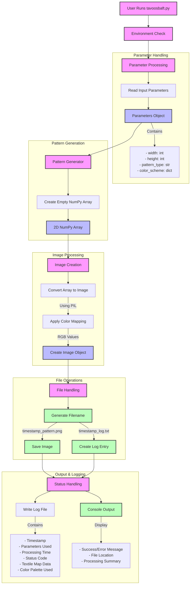

<p align="right">
  <a href="README.fa.md">
    
  </a>
</p>

# 🧵 Tavoos Baft

Tavoos Baft is a Python-based tool for generating custom textile pattern maps. Designed for both technical users and beginners, it automates the process of creating, saving, and analyzing textile designs with minimal setup.

---

## 🛠️ Features

- **Automated Pattern Generation:** Create textile maps with customizable parameters.
- **Image Output:** Save generated patterns as image files for easy sharing and printing.
- **Log File**: Includes run details, final color palette, and the coded textile map.
- **Beginner-Friendly:** Step-by-step instructions for users with no prior Python experience.
- **Single-Command Setup:** Install all required libraries with one command.
- **Free to Use:** Licensed for **personal and non-commercial use** only. Commercial use is prohibited.

---

## 📦 Installation & Setup (for Windows)

### 1. Install Python

If you don’t have Python installed:
- Download Python from [python.org](https://www.python.org/downloads/).
- Run the installer and check “Add Python to PATH” during installation.

### 2. Download Tavoos Baft Script

- Visit the [GitHub repository](https://github.com/rezasadid753/tavoosbaft).
- Click the green “Code” button, then “Download ZIP”.
- Extract the ZIP file to a folder (e.g., `C:\TavoosBaft`).

### 3. Install Required Libraries

Open **Command Prompt** (press `Win + R`, type `cmd`, press Enter).

Navigate to the folder where you saved the script:
```powershell
cd C:\TavoosBaft
```

Install all required libraries with one command:
```powershell
pip install pillow numpy matplotlib
```

---

## 🖱️ Usage Guide

1. **Open Command Prompt** and navigate to the folder:
   ```powershell
   cd C:\TavoosBaft
   ```
2. **Run the script**:
   ```powershell
   python tavoosbaft.py image="/abs/path" color="Integer" rajshomar="Integer" widthcm="Integer" or widthpx="Integer"
   ```
<details>
<summary>Detailed Command Structure Breakdown</summary>
When running the script, ensure you replace the placeholder values with specific data. You must provide the image, color, and rajshomar parameters, and exactly one of the width parameters (widthcm or widthpx).

- **`image="/abs/path"`**: The absolute file path to your source image.
    - **Example**: `image="C:/Users/YourName/Desktop/my_design.png"` (Note the forward slashes often work better).
    - **Supported Formats**: The file must be a `.jpg`, `.jpeg`, or `.png` file.

- **`color="Integer"`**: Sets the target number of colors, $K$, in the final output pattern.
    - **Example**: `color="90"`. This means the image processing will reduce the original color palette to a maximum of 90 distinct colors using K-reduction.

- **`rajshomar="Integer"`**: Specifies the **Raj Shomar** value (density) for the textile pattern calculation.
    - **Example**: `rajshomar="46"`. This value determines the resolution and fineness of the resulting woven structure.

- **`widthcm="Integer"`** **OR** **`widthpx="Integer"`**: **Use ONLY one of these two parameters.**
    - **`widthcm`**: Defines the physical width of the final textile in **centimeters**.
        - **Example**: `widthcm="150"`.
    - **`widthpx`**: Defines the pattern width in **pixels**. This value often corresponds directly to the known **Knot Count** or weave structure width of the textile you are designing for (e.g., the width of a known carpet loom).
        - **Example**: `widthpx="800"`.

| Parameter | Type | Description | Example | Notes |
| :--- | :--- | :--- | :--- | :--- |
| `image` | String | **Absolute path** to the source image file (`.jpg`, `.jpeg`, or `.png`). | `image="C:\Users\John\Desktop\design.jpg"` | The path must be complete and absolute. |
| `color` | Integer | The target number of **K reduced colors** (the final color count) in the output pattern. | `color="90"` | This limits the output pattern to 90 distinct colors. |
| `rajshomar` | Integer | The **Raj Shomar** value (density) for the textile pattern calculation. | `rajshomar="46"` | This determines the fineness/resolution of the woven structure. |
| `widthcm` | Integer | The desired final width of the textile in **centimeters**. | `widthcm="200"` | Use this to set the physical dimension. **Use ONLY one** of `widthcm` or `widthpx`. |
| `widthpx` | Integer | The desired width of the pattern in **pixels**. | `widthpx="800"` | This typically corresponds to the **Knot Count** or known weave structure width. **Use ONLY one** of `widthcm` or `widthpx`. |
</details>

3. **Output Files:**
   - **Image File:** The generated pattern will be saved in the same folder (e.g., `image.png`).
   - **Log File:** Every run generates a log file (e.g., `image.png`) detailing processing steps, parameters, the final sorted color palette, the coded textile map, and any encountered errors.

---

## 📂 Output Details

- **Image File:** Contains the visual representation of your textile pattern.
- **Log File:** Includes:
  - Timestamp of run
  - Parameters used for generation (e.g., target K colors, resize dimensions)
  - Step-by-step breakdown of the algorithm (e.g., K-Means convergence, Luma sorting)
  - A listing of all K reduced colors (R, G, B values) in their sorted order.
  - Coded textile map with the calculated percentage area and corresponding pixel rows/columns.

---

## ✨ Showcase: Floral Ladies and Bird Hans Zatzka Classic Flowers

This section presents a beautiful example of a famous artwork processed by Tavoos Baft. The resulting output is a color-reduced, sized-down image and the corresponding textile codes, ready for weaving.

### Original vs. Processed Image

| Original Art Image | Processed Map Image |
| :---: | :---: |
|  |  |
| The **original**, full-color art piece. | The **reduced** image (width=350px, colors=90) used to generate the codes. |

### Downloadable Codes and Color Palette

The Tavoos Baft script processes the image and generates a comprehensive log file. For ease of use and immediate reference, two neatly designed PDF versions have been created from the log file, detailing the final output:

* **[Download Coded Pattern File (`codes.pdf`)](Showcases/Floral%20Ladies%20and%20Bird%20Hans%20Zatzka%20Classic%20Flowers/codes.pdf)**
* **[Download Color Palette File (`colors.pdf`)](Showcases/Floral%20Ladies%20and%20Bird%20Hans%20Zatzka%20Classic%20Flowers/colors.pdf)**

### 🖼️ Art & Licensing Note

The source image for this showcase is the exquisite work **"Floral Ladies and Bird Classic Flowers"** by the highly celebrated Austrian artist **Hans Zatzka**.

Since the artist, Hans Zatzka, died in 1945, this artwork is generally considered to be in the **Public Domain** in many regions (like the US and countries following the life-plus-70 years rule, as of 2025). This showcase is presented under the belief that the original artwork is in the public domain and, in accordance with the Tavoos Baft license, the resulting pattern is for **personal and non-commercial use only.**

**A Note on the Source:** This specific image was originally discovered via a Google search on an Amazon product gallery, which did not provide a definitive official source or reference. If you know the exact, authoritative source of this particular reproduction, please open an issue or contact me so I can give proper attribution.

### 💖 Your Contributions

Tavoos Baft is a tool for the community. If you have generated your own beautiful textile codes using Tavoos Baft, I would love to feature them here!

**Feel free to send your:**
* **Log Files** or the **`codes.pdf`** and **`colors.pdf`** you create.
* The **original image** you used.
* Pictures of your **finished woven carpet**!

Please send all submissions to **rezasadid753@gmail.com** to be published here with your name.

---

## 📊 Diagram



---

## 📝 License

**Tavoos Baft** is licensed under the **Creative Commons Attribution-NonCommercial 4.0 International Public License (CC BY-NC 4.0)**.

This means you are free to use, modify, and distribute this tool for **personal, non-commercial purposes** only. Any commercial use is strictly prohibited. You must also give appropriate credit to the original author.

---

## 💡 Support

For questions or issues, open an issue on the [GitHub repository](https://github.com/rezasadid753/tavoosbaft/issues).
